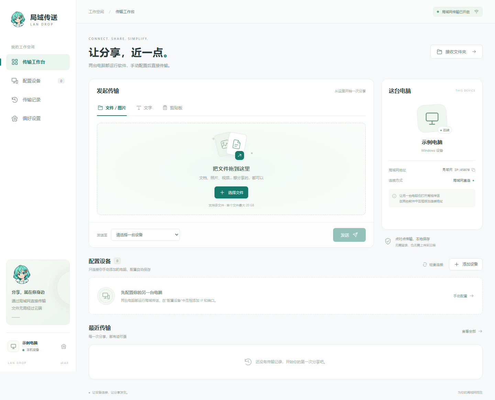
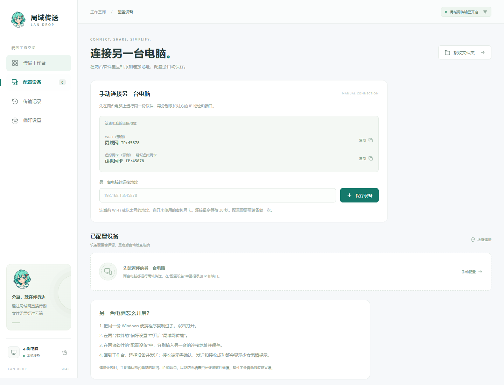
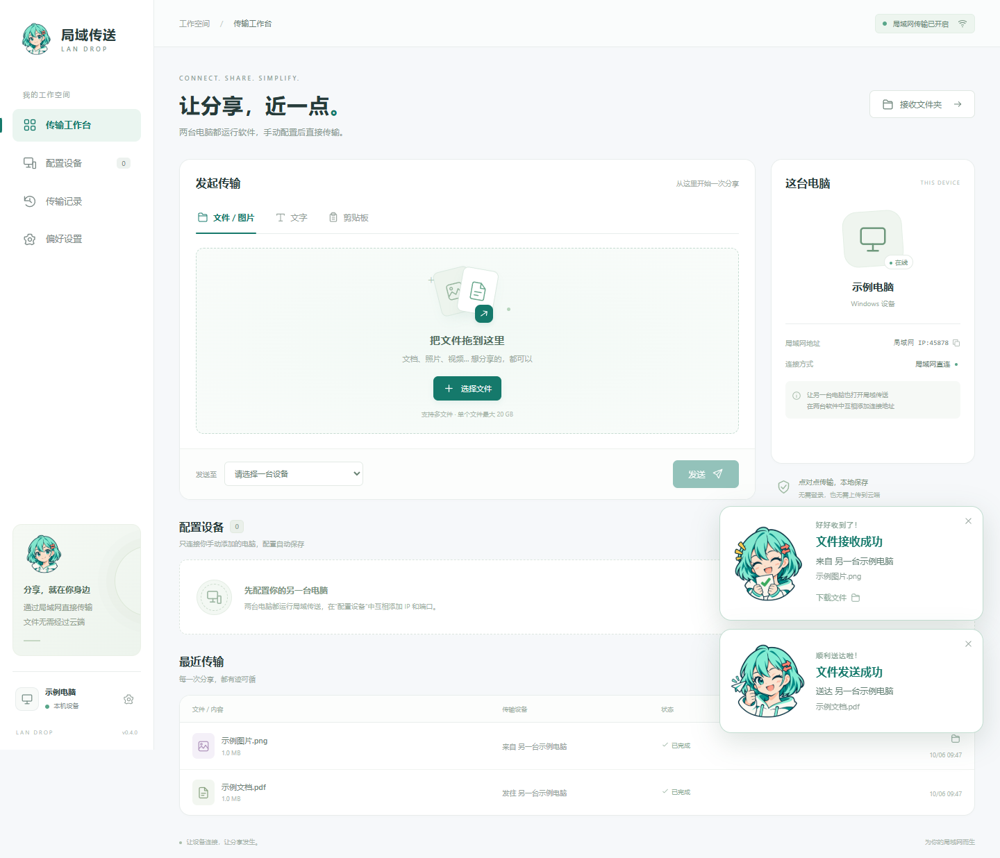

# PCdeliver · 局域传送

<p align="center"></p>

在同一个局域网中，直接在两台电脑之间传输文档、图片、音频、视频、文字和剪贴板截图。中文桌面界面，手动配置设备，无需账号或云端存储。

**两台电脑都需要安装并运行本软件，再互相添加连接地址。**

## 下载与主要功能

[下载 Windows x64 安装包（v0.4.0）](https://github.com/Hjnandlizhiyan/PCdeliver/releases/download/v0.4.0/LanDrop-0.4.0-Setup.exe) · [查看所有版本](https://github.com/Hjnandlizhiyan/PCdeliver/releases)

- 文件按原内容传输，单个文件上限 20 GB；支持多文件选择、拖放、进度与取消。
- 文字、链接与剪贴板截图传输，发送和接收成功显示少女表情提示。
- SHA-256 完整性校验，同名文件自动加编号，失败时清理未完成文件。
- 托盘图标、桌面与开始菜单快捷方式，可隐藏窗口继续接收或完全退出。
- 安装位置可选，配置和默认接收文件保存于安装目录；覆盖升级与卸载默认保留数据。

## 软件预览



预览图使用演示数据，设备名称、连接地址和接收目录均为通用占位信息。



薄荷绿短发少女搭配双向箭头发夹，采用扁平彩色漫画风格。形象用于应用 Logo、桌面图标和软件界面，保留透明背景。

[高清 Logo](assets/branding/landrop-girl.png) · [设计与生成提示词](assets/branding/generation.json)



发送成功显示眨眼点赞表情，接收成功显示抱着文件的开心表情。提示显示在软件窗口右下角，10 秒后自动收起，也可手动关闭；连续成功会合并计数。可从提示中查看文字或打开接收文件的位置。

[接收成功表情](assets/branding/landrop-girl-received.png) · [发送成功表情](assets/branding/landrop-girl-sent.png) · [表情生成记录](assets/branding/expressions-generation.json)

## 在两台电脑上使用

1. 从上方下载入口获取 `LanDrop-0.4.0-Setup.exe`，在两台 Windows 电脑上分别安装。安装向导可选择文件夹，例如 `D:\软件\局域传送`，不需要另装 Node.js。请选择当前账户可以写入的目录。
2. 两台电脑连接同一个局域网。在双方软件的“偏好设置”中打开“启用局域网传输”并保存；默认已经开启。
3. 双方进入“配置设备”，查看“这台电脑的连接地址”，分别填写另一台电脑的地址并点击“保存设备”。
4. 回到工作台，选择已配置的在线设备，添加文件或输入文字，点击“发送”。
5. 对方软件直接接收，无需点击确认。发送端和接收端成功后都会显示少女表情提示。文件保存在对方的接收文件夹，文字在传输记录中查看。

安装完成后，会自动在桌面和开始菜单创建“局域传送”快捷方式，使用软件少女图标，双击即可打开软件。

### 托盘与完全退出

软件运行时，Windows 右下角通知区域会显示少女图标；如果没有直接显示，点击“小三角”展开隐藏图标。单击或双击图标可以打开窗口。

右键菜单提供“打开窗口”“隐藏窗口（继续运行）”“打开接收文件夹”和“退出软件（停止传输）”。隐藏窗口后软件继续接收；选择退出会停止传输、清理未完成文件、保存记录并结束后台进程，退出后即可删除或更换程序。窗口右上角的关闭按钮也会完整退出。

运行新版安装包即可覆盖升级：安装器识别原安装位置，只替换程序文件，保留配置、文字历史和接收文件。后台空闲的软件会被请求正常退出；正在传输时安装器会停止并提示先完成或取消传输，随后可重试，不会强制结束进程。没有托盘功能的旧便携版仍需先自行退出。

### 安装目录与数据保留

默认目录结构如下，安装在 D 盘时，接收文件、配置和运行缓存也都在 D 盘：

```text
所选安装目录/
  局域传送.exe        程序与运行组件
  接收文件/          默认接收位置
  数据/
    配置/state.json  设备身份、设备配置、开关和文字历史
    运行缓存/        窗口运行缓存
```

接收位置仍可在偏好设置中更改。请选普通文件夹，不能使用程序根目录、`resources`、`locales` 或“数据”文件夹。后续升级沿用原安装目录；移动整个安装位置需退出软件后另行迁移，不能通过覆盖安装直接改位置。

第一次从旧便携版改为安装版时，首次启动会询问是否迁移这台电脑的旧数据。先退出旧版，确认后复制设备配置、现存文字记录和旧接收文件夹的文件，逐个校验并更新历史中的文件位置。旧原件不会被删除；确认迁移成功后可自行清理旧接收目录。迁移会临时占用一份文件大小的额外空间，包含大文件时请等待。迁移失败会保留旧版原件并停止启动，避免覆盖已有数据。安装版建立独立数据后，不会再从旧版导入已删除文字。

卸载默认只移除程序和快捷方式，保留安装目录内的个人数据与接收文件。重新安装到原位置可继续使用；需要彻底清理时，退出软件后自行删除保留的文件夹。迁移后在新软件里删除文字，不会修改保留的旧版原件。

升级方式是下载并运行新版安装包，不需要搭建更新服务器。软件没有联网检查更新、自动下载或静默升级功能。

### 人为删除文字消息

在“最近传输”或“传输记录”中，点击文字记录旁的“删除”；也可打开“查看文字”后点击“删除本机记录”。这会从当前电脑的运行记录和本地保存的历史中移除文字，重启后不会恢复。另一台电脑的记录需要在那台电脑上单独删除。关闭查看文字窗口时会清空窗口中的文字内容。

“清空记录”可以一次清理已结束的传输记录；接收到的文件仍保留在接收文件夹中。正在传输的记录不能直接删除，需先取消传输。

在 A 的软件里添加 B 的连接地址，在 B 的软件里添加 A 的连接地址，格式为 `对方的局域网 IP:45878`。配置自动保存，重启后仍然有效；如果 IP 改变，在双方软件中重新配置地址。

**两台电脑都必须运行本软件，并互相添加配置。** 本机浏览器页面只是界面预览；`127.0.0.1` 指当前电脑，不能用来连接另一台电脑。未配置的设备无法向你发送内容。

连接失败时先确认另一台的软件已运行、地址正确、双方传输开关已开启。如果防火墙拦截，需要人为允许软件通信或放行专用网络下的 TCP `45878`。软件不会远程启动另一台电脑的软件，也不会自动修改防火墙或绕过网络隔离。

连接等待时间为 30 秒，添加设备、定期检查连接和发送前检查使用相同的等待时间，避免慢速回应的设备过早显示离线。“配置设备”会标明每个地址所属的网卡，可单独复制；优先使用当前 Wi-Fi 或以太网地址。连接失败的提示会保留在输入框下方，并区分端口未连通、端口已连接但没有及时回应、连接被拒绝等情况。

这是未签名的试作版，Windows 可能显示未知发布者提示。

## 已实现

- 手动配置对方 IP 和端口，设备配置自动保存，重新打开后检查连接。
- 双方手动互相添加后，文件和文字直接接收，无接收确认弹窗；发送、接收成功显示少女表情提示。
- 局域网传输开关，关闭后暂停文件与文字的发送和接收。
- 多文件选择与拖放，图片和视频以原文件发送；单个文件上限 20 GB。
- 文字、链接与剪贴板截图传输，收到的文字在记录中查看与复制。
- 实时进度、速度、取消、连接失败状态；在“配置设备”中检查连接或移除设备。
- SHA-256 完整性校验，同名文件自动加编号；传输失败、取消或退出时清理不完整文件。
- 本地保存传输历史、设备名称与接收目录。
- 已结束的文字记录可逐条删除，立即从运行记录中移除并更新本地保存的历史。
- Windows 托盘图标与右键退出菜单，可隐藏窗口继续运行，或完整退出释放后台进程。
- 中文安装向导与可选安装位置，安装目录内保存数据和默认接收文件；覆盖升级与卸载均保留个人数据。
- 首次安装可迁移旧便携版数据，复制校验接收文件并保留原件。
- 桌面版打开接收目录和定位文件；本机预览版可从记录下载接收文件。

## 开发与运行

使用 Node.js 22.12 或更新版本。

```powershell
git clone https://github.com/Hjnandlizhiyan/PCdeliver.git
cd PCdeliver
npm install
npm start
```

若 Electron 运行组件下载超时，可先设置备用镜像再安装；安装程序会使用 Electron 包内提供的校验值验证下载内容：

```powershell
$env:ELECTRON_MIRROR = 'https://npmmirror.com/mirrors/electron/'
npm install
```

也可双击项目里的 `启动局域传送.cmd`。首次使用会安装桌面运行依赖，需要互联网；安装后日常传输不需要互联网。

浏览器调试版不需要安装依赖：

```powershell
node server/start.js
```

打开 `http://127.0.0.1:45878`。浏览器版默认接收目录为 `.landrop/received`；更改接收目录需要使用桌面版。

```powershell
npm test       # 双实例传输集成测试
npm run pack   # 打包 Windows x64 安装包，输出到 release/
```

安装器的真实升级验证使用独立的测试软件名称和安装登记，不安装正式版。测试环境需要可用的 Playwright Electron API（也可用 `PLAYWRIGHT_MODULE` 指定模块位置），然后运行：

```powershell
npm run pack:qa           # 构建 0.3.99 和 0.4.0 两个测试安装包
npm run verify:installer  # 安装、升级、传输保护和卸载验证
```

测试文件均在 `.landrop/` 内；卸载后会保留测试数据，以便检查结果。正式发布仍使用 `npm run pack`，不要分发 QA 安装包。

浏览器版的实例参数可以通过环境变量设置：

```powershell
$env:LANDROP_PORT = '45880'
$env:LANDROP_NAME = '示例电脑'
$env:LANDROP_DATA_DIR = '.landrop/demo'
node server/start.js
```

后续版本需保持 `build.appId`、软件包名称和数据目录约定不变，以继续识别既有安装和本地数据。打包后的安装包在 GitHub Releases 分发，运行数据、测试输出与依赖不提交到源码仓库。

`scripts/preview.cjs` 使用固定演示数据生成 README 预览图，不读取真实设备配置；运行需要 Playwright 和可用的 Microsoft Edge。

## 项目结构

| 路径 | 内容 |
| --- | --- |
| `desktop/` | Electron 桌面窗口、原生文件选择、目录操作与剪贴板桥接 |
| `server/app.js` | HTTP 接口、传输状态、流式文件接收、完整性校验、本地存储 |
| `server/network.js` | 局域网地址识别与校验 |
| `public/` | 中文界面、交互与响应式布局 |
| `test/` | 双实例真实传输的自动化测试 |
| `desktop/storage.js` | 安装目录内存储、便携版迁移和复制校验 |
| `build/installer.nsh` | 安装向导、后台正常退出、按程序清单替换与数据保留 |
| `scripts/verify-installer.cjs` | 独立 QA 安装包的真实安装、升级和卸载验证 |

## 验证与目前边界

已通过 24 项测试：双方手动配置、自动接收、未配置设备拒绝、传输开关、文件完整性、断线与取消清理、配置与历史恢复、移除设备、页面重连和传输中退出，以及超过 5 秒的设备回应、网卡分类、连接错误判断、逐条删除文字与删除保护、托盘菜单动作和托盘资源管理；另包含安装存储、旧版迁移、损坏配置保护、中断恢复及迁移目录重叠保护验证。实际界面还验证了发送和接收表情提示、重复状态去重、删除后的文字窗口清理以及页面重开后不重放旧提示。Windows 桌面验证确认了托盘初始化、进程退出和传输端口释放。安装器还实际验证了 D 盘中文与空格路径、0.3.99 到 0.4.0 覆盖升级、托盘后台正常退出、传输中阻止覆盖、设备身份与文字记录保留、已删除文字不恢复，以及卸载保留个人数据。跨实体电脑和不同防火墙环境仍需要实机验证。

当前使用 IPv4 局域网 HTTP 直连，内容未端到端加密，适合可信的家庭或办公局域网。只从你手动配置的设备接收内容。接收后不自动打开文件、不自动粘贴文字；成功提示显示在软件窗口内。

此版只使用 TCP `45878`（自定义端口除外），不使用 UDP 自动发现、组播或广播。访客 Wi-Fi、设备隔离、VPN 和防火墙可能阻止连接，这些需要人为配置网络。

暂不支持文件夹直接发送、断点续传、端到端加密或跨公网传输。文件夹可以先压缩后发送。关闭软件会结束服务并中止未完成的传输。
