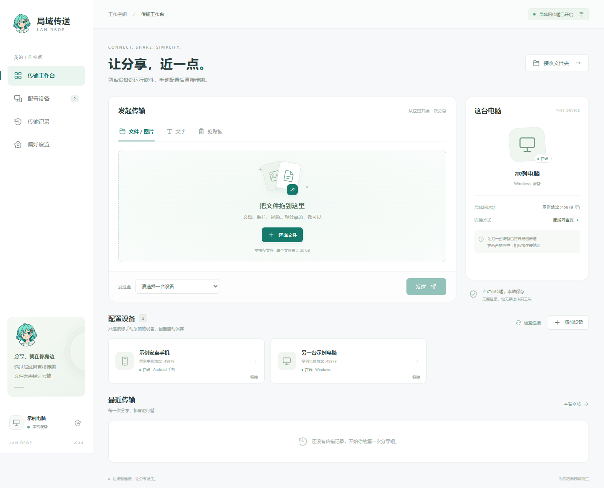
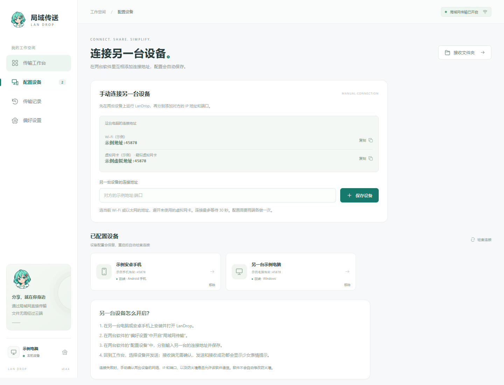
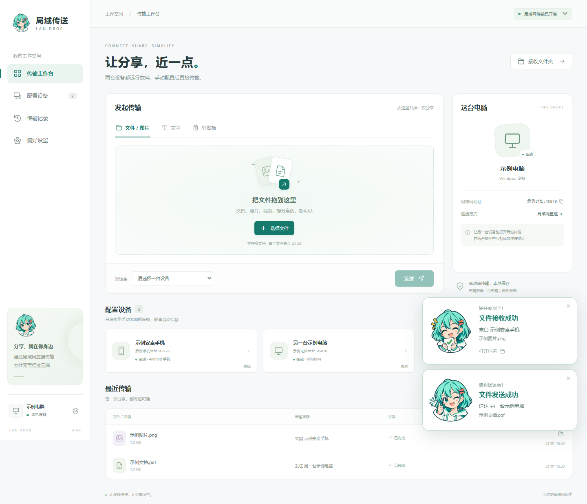
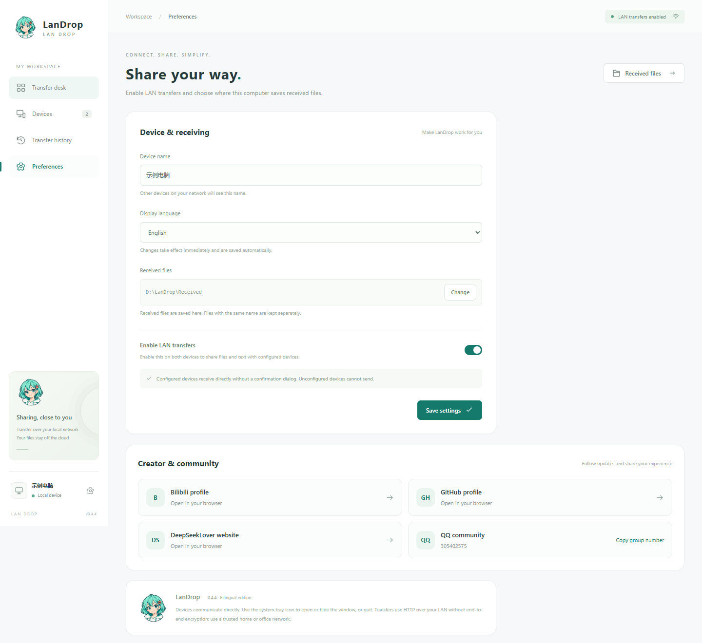

# PCdeliver · 局域传送 / LanDrop

<p align="center"></p>

[简体中文](#简体中文) · [English](#english)

**v0.4.4**：电脑版正确显示安卓手机的名称与手机图标，重新检查连接时刷新设备类型。README 的全部预览图使用固定演示数据生成，地址和输入框以“示例地址”代替数字 IP。保留作者主页、官网、QQ 群入口和中英文界面。

**v0.4.4** recognizes Android phones with phone icons and bilingual labels, and refreshes saved device types on reconnection. All README screenshots use isolated demo data and example address labels, without numeric IPs or personal machine identities.

## 简体中文

在同一个局域网中，直接与另一台电脑或安卓手机传输文档、图片、音频、视频、文字和剪贴板截图。中英文可切换的桌面界面，手动配置设备，无需账号或云端存储。

v0.4.2 中英文切换版：进入“偏好设置 → 界面语言”，选择“简体中文”或“English”，立即生效并自动保存，重启后仍使用所选语言。界面、状态与错误提示、托盘菜单和桌面弹窗同步切换；两台电脑可以分别使用不同语言。设备名称、文件名、接收目录和传输的文字保持原样。安装向导可选择中文或英文，其语言与应用内的语言设置分别保存。

也可通过 `npm run pack` 在本地生成 `release/LanDrop-0.4.4-Setup.exe`。下方下载入口为 v0.4.4。

v0.4.2 补齐了“以太网”“本地连接”等常见系统网卡名称及编号的翻译；例如英文界面显示 `Ethernet 2`，中文界面显示“以太网 2”。自定义网卡名称保持原样，系统里的实际网卡名称不会被修改。

**两台设备都需要安装并运行 LanDrop，再互相添加连接地址。安卓版本见 [LanDrop-Android](https://github.com/Hjnandlizhiyan/LanDrop-Android/releases/latest)。**

### 下载与主要功能

[下载 Windows x64 安装包（v0.4.4）](https://github.com/Hjnandlizhiyan/PCdeliver/releases/download/v0.4.4/LanDrop-0.4.4-Setup.exe) · [SHA-256 校验文件](https://github.com/Hjnandlizhiyan/PCdeliver/releases/download/v0.4.4/SHA256-0.4.4.txt) · [查看所有版本](https://github.com/Hjnandlizhiyan/PCdeliver/releases)

- 文件按原内容传输，单个文件上限 20 GB；支持多文件选择、拖放、进度与取消。
- 文字、链接与剪贴板截图传输，发送和接收成功显示少女表情提示。
- SHA-256 完整性校验，同名文件自动加编号，失败时清理未完成文件。
- 托盘图标、桌面与开始菜单快捷方式，可隐藏窗口继续接收或完全退出。
- 安装位置可选，配置和默认接收文件保存于安装目录；覆盖升级与卸载默认保留数据。
- 中英文界面即时切换并自动保存，托盘和桌面弹窗同步切换；安装向导也支持中文与英文。

### 软件预览



预览图使用演示数据，设备名称、连接地址和接收目录均为通用占位信息。



薄荷绿短发少女搭配双向箭头发夹，采用扁平彩色漫画风格。形象用于应用 Logo、桌面图标和软件界面，保留透明背景。

[高清 Logo](assets/branding/landrop-girl.png) · [设计与生成提示词](assets/branding/generation.json)



发送成功显示眨眼点赞表情，接收成功显示抱着文件的开心表情。提示显示在软件窗口右下角，10 秒后自动收起，也可手动关闭；连续成功会合并计数。可从提示中查看文字或打开接收文件的位置。

[接收成功表情](assets/branding/landrop-girl-received.png) · [发送成功表情](assets/branding/landrop-girl-sent.png) · [表情生成记录](assets/branding/expressions-generation.json)

[英文偏好设置预览](docs/settings-en-0.4.4.png)

### 在两台电脑上使用

1. 在两台 Windows 电脑上分别安装同一版本的软件。下载 `LanDrop-0.4.4-Setup.exe`，或使用本地生成的 `release/LanDrop-0.4.4-Setup.exe`。安装向导可选择文件夹，例如 `D:\软件\局域传送`，不需要另装 Node.js。请选择当前账户可以写入的目录。
2. 两台电脑连接同一个局域网。在双方软件的“偏好设置”中打开“启用局域网传输”并保存；默认已经开启。
3. 双方进入“配置设备”，查看“这台电脑的连接地址”，分别填写另一台电脑的地址并点击“保存设备”。
4. 回到工作台，选择已配置的在线设备，添加文件或输入文字，点击“发送”。
5. 对方软件直接接收，无需点击确认。发送端和接收端成功后都会显示少女表情提示。文件保存在对方的接收文件夹，文字在传输记录中查看。

安装完成后，会自动在桌面和开始菜单创建“局域传送”快捷方式，使用软件少女图标，双击即可打开软件。

#### 托盘与完全退出

软件运行时，Windows 右下角通知区域会显示少女图标；如果没有直接显示，点击“小三角”展开隐藏图标。单击或双击图标可以打开窗口。

右键菜单提供“打开窗口”“隐藏窗口（继续运行）”“打开接收文件夹”和“退出软件（停止传输）”。隐藏窗口后软件继续接收；选择退出会停止传输、清理未完成文件、保存记录并结束后台进程，退出后即可删除或更换程序。窗口右上角的关闭按钮也会完整退出。

运行新版安装包即可覆盖升级：安装器识别原安装位置，只替换程序文件，保留配置、文字历史和接收文件。后台空闲的软件会被请求正常退出；正在传输时安装器会停止并提示先完成或取消传输，随后可重试，不会强制结束进程。没有托盘功能的旧便携版仍需先自行退出。

#### 安装目录与数据保留

默认目录结构如下，安装在 D 盘时，接收文件、配置和运行缓存也都在 D 盘：

```text
所选安装目录/
  局域传送.exe        程序与运行组件
  接收文件/          默认接收位置
  数据/
    配置/state.json  设备身份、设备配置、开关和文字历史
    运行缓存/        窗口运行缓存
```

接收位置仍可在偏好设置中更改。请选普通文件夹，不能使用程序根目录、`resources`、`locales` 或“数据”文件夹。后续升级沿用原安装目录；移动整个安装位置需退出软件后另行迁移，不能通过覆盖安装直接改位置。

第一次从旧便携版改为安装版时，首次启动会询问是否迁移这台电脑的旧数据。先退出旧版，确认后复制设备配置、现存文字记录和旧接收文件夹的文件，逐个校验并更新历史中的文件位置。旧原件不会被删除；确认迁移成功后可自行清理旧接收目录。迁移会临时占用一份文件大小的额外空间，包含大文件时请等待。迁移失败会保留旧版原件并停止启动，避免覆盖已有数据。安装版建立独立数据后，不会再从旧版导入已删除文字。

卸载默认只移除程序和快捷方式，保留安装目录内的个人数据与接收文件。重新安装到原位置可继续使用；需要彻底清理时，退出软件后自行删除保留的文件夹。迁移后在新软件里删除文字，不会修改保留的旧版原件。

升级方式是下载并运行新版安装包，不需要搭建更新服务器。软件没有联网检查更新、自动下载或静默升级功能。

#### 人为删除文字消息

在“最近传输”或“传输记录”中，点击文字记录旁的“删除”；也可打开“查看文字”后点击“删除本机记录”。这会从当前电脑的运行记录和本地保存的历史中移除文字，重启后不会恢复。另一台电脑的记录需要在那台电脑上单独删除。关闭查看文字窗口时会清空窗口中的文字内容。

“清空记录”可以一次清理已结束的传输记录；接收到的文件仍保留在接收文件夹中。正在传输的记录不能直接删除，需先取消传输。

在 A 的软件里添加 B 的连接地址，在 B 的软件里添加 A 的连接地址，格式为 `对方的局域网 IP:45878`。配置自动保存，重启后仍然有效；如果 IP 改变，在双方软件中重新配置地址。

**两台电脑都必须运行本软件，并互相添加配置。** 本机浏览器页面只是界面预览；`127.0.0.1` 指当前电脑，不能用来连接另一台电脑。未配置的设备无法向你发送内容。

连接失败时先确认另一台的软件已运行、地址正确、双方传输开关已开启。如果防火墙拦截，需要人为允许软件通信或放行专用网络下的 TCP `45878`。软件不会远程启动另一台电脑的软件，也不会自动修改防火墙或绕过网络隔离。

连接等待时间为 30 秒，添加设备、定期检查连接和发送前检查使用相同的等待时间，避免慢速回应的设备过早显示离线。“配置设备”会标明每个地址所属的网卡，可单独复制；优先使用当前 Wi-Fi 或以太网地址。连接失败的提示会保留在输入框下方，并区分端口未连通、端口已连接但没有及时回应、连接被拒绝等情况。

这是未签名的试作版，Windows 可能显示未知发布者提示。

### 已实现

- 手动配置对方 IP 和端口，设备配置自动保存，重新打开后检查连接。
- 双方手动互相添加后，文件和文字直接接收，无接收确认弹窗；发送、接收成功显示少女表情提示。
- 局域网传输开关，关闭后暂停文件与文字的发送和接收。
- 多文件选择与拖放，图片和视频以原文件发送；单个文件上限 20 GB。
- 文字、链接与剪贴板截图传输，收到的文字在记录中查看与复制。
- 实时进度、速度、取消、连接失败状态；在“配置设备”中检查连接或移除设备。
- SHA-256 完整性校验，同名文件自动加编号；传输失败、取消或退出时清理不完整文件。
- 本地保存传输历史、设备名称与接收目录。
- 已结束的文字记录可逐条删除，立即从运行记录中移除并更新本地保存的历史。
- Windows 托盘图标与右键退出菜单，可隐藏窗口继续运行，或完整退出释放后台进程。
- 简体中文与 English 即时切换，语言设置自动保存，界面、提示、托盘菜单和桌面弹窗同步切换。
- 中英文安装向导与可选安装位置，安装目录内保存数据和默认接收文件；覆盖升级与卸载均保留个人数据。
- 首次安装可迁移旧便携版数据，复制校验接收文件并保留原件。
- 桌面版打开接收目录和定位文件；本机预览版可从记录下载接收文件。

### 开发与运行

使用 Node.js 22.12 或更新版本。

```powershell
git clone https://github.com/Hjnandlizhiyan/PCdeliver.git
cd PCdeliver
npm install
npm start
```

若 Electron 运行组件下载超时，可先设置备用镜像再安装；安装程序会使用 Electron 包内提供的校验值验证下载内容：

```powershell
$env:ELECTRON_MIRROR = 'https://npmmirror.com/mirrors/electron/'
npm install
```

也可双击项目里的 `启动局域传送.cmd`。首次使用会安装桌面运行依赖，需要互联网；安装后日常传输不需要互联网。

浏览器调试版不需要安装依赖：

```powershell
node server/start.js
```

打开 `http://127.0.0.1:45878`。浏览器版默认接收目录为 `.landrop/received`；更改接收目录需要使用桌面版。

```powershell
npm test       # 双实例传输集成测试
npm run pack   # 打包 Windows x64 安装包，输出到 release/
```

中英文界面和打包后的桌面程序还可单独验证。需要可用的 Playwright（可通过 `PLAYWRIGHT_MODULE` 指定模块位置）和 Microsoft Edge；桌面验证需先完成打包：

```powershell
npm run test:i18n-ui       # 语言切换、重启保存、不同语言设备间传输与排版
npm run test:i18n-desktop  # 打包桌面程序的托盘、提示、原生弹窗与重启保存
```

这些验证使用独立的临时数据，不读取个人设备配置；演示截图输出到 `test-output/i18n/`。

安装器的真实升级验证使用独立的测试软件名称和安装登记，不安装正式版。测试环境需要可用的 Playwright Electron API（也可用 `PLAYWRIGHT_MODULE` 指定模块位置），然后运行：

```powershell
npm run pack:qa           # 构建 0.3.99 和 0.4.0 两个测试安装包
npm run verify:installer  # 安装、升级、传输保护和卸载验证
```

测试文件均在 `.landrop/` 内；卸载后会保留测试数据，以便检查结果。正式发布仍使用 `npm run pack`，不要分发 QA 安装包。

浏览器版的实例参数可以通过环境变量设置：

```powershell
$env:LANDROP_PORT = '45880'
$env:LANDROP_NAME = '示例电脑'
$env:LANDROP_DATA_DIR = '.landrop/demo'
node server/start.js
```

后续版本需保持 `build.appId`、软件包名称和数据目录约定不变，以继续识别既有安装和本地数据。打包后的安装包在 GitHub Releases 分发，运行数据、测试输出与依赖不提交到源码仓库。

`scripts/preview.cjs` 使用固定演示数据生成 README 预览图，不读取真实设备配置；运行需要 Playwright 和可用的 Microsoft Edge。

### 项目结构

| 路径 | 内容 |
| --- | --- |
| `desktop/` | Electron 桌面窗口、原生文件选择、目录操作与剪贴板桥接 |
| `server/app.js` | HTTP 接口、传输状态、流式文件接收、完整性校验、本地存储 |
| `server/network.js` | 局域网地址识别与校验 |
| `public/` | 中英文界面、交互与响应式布局 |
| `public/i18n.js` | 共享翻译词典、参数替换和旧版错误信息翻译 |
| `test/` | 双实例真实传输的自动化测试 |
| `desktop/storage.js` | 安装目录内存储、便携版迁移和复制校验 |
| `build/installer.nsh` | 安装向导、后台正常退出、按程序清单替换与数据保留 |
| `scripts/verify-installer.cjs` | 独立 QA 安装包的真实安装、升级和卸载验证 |
| `scripts/verify-i18n-ui.cjs` | 语言切换、混合语言设备传输与英文排版验证 |
| `scripts/verify-i18n-desktop.cjs` | 打包桌面程序的双语托盘与原生弹窗验证 |

### 验证与目前边界

当前已通过 29 项自动化测试，覆盖双方配置、直接接收、未配置设备拒绝、传输开关、文件完整性、断线与取消清理、配置与历史恢复、文字删除保护、页面重连与传输中退出、慢速回应、网卡分类、连接错误、托盘动作与资源管理、安装存储、旧版迁移、损坏配置保护、中断恢复及迁移目录重叠保护，以及翻译覆盖、语言持久化、无效语言保护和与错误文案无关的拒绝状态判断。

v0.4.2 还实际验证了中英文反复切换、重启后保留语言、两端使用不同语言时的文字与文件传输、收到的文字保持原样、历史错误翻译，以及 1040 和 1380 像素宽度下的英文排版。打包后的 Windows 桌面程序验证了托盘菜单、悬浮提示、原生文件与目录选择弹窗、窗口标题和重启语言设置。

此前还验证了发送和接收表情提示、重复状态去重、删除后的文字窗口清理、页面重开后不重放旧提示、进程退出和端口释放，以及独立 QA 安装包的 D 盘中文与空格路径、0.3.99 到 0.4.0 覆盖升级、后台正常退出、传输中阻止覆盖、身份与记录保留和卸载保留个人数据。跨实体电脑和不同防火墙环境仍需要实机验证。

当前使用 IPv4 局域网 HTTP 直连，内容未端到端加密，适合可信的家庭或办公局域网。只从你手动配置的设备接收内容。接收后不自动打开文件、不自动粘贴文字；成功提示显示在软件窗口内。

此版只使用 TCP `45878`（自定义端口除外），不使用 UDP 自动发现、组播或广播。访客 Wi-Fi、设备隔离、VPN 和防火墙可能阻止连接，这些需要人为配置网络。

暂不支持文件夹直接发送、断点续传、端到端加密或跨公网传输。文件夹可以先压缩后发送。关闭软件会结束服务并中止未完成的传输。

## English

LanDrop transfers documents, images, audio, video, text, and clipboard screenshots directly between computers and Android phones on the same local network. The desktop interface supports Simplified Chinese and English. Devices are configured manually; no account or cloud storage is required.

The **v0.4.2 bilingual edition** adds **Preferences → Display language**. Choose **简体中文** or **English** to switch immediately. Your choice is saved automatically and restored at startup. The interface, status and error messages, tray menus, and desktop dialogs use the selected language. Each computer can use a different language. Device names, filenames, receive paths, and transferred text keep their original content. The installer also supports Chinese and English; installer language and application language are saved separately.

You can also build the installer locally with `npm run pack`; the output is `release/LanDrop-0.4.4-Setup.exe`. The download below points to v0.4.4.

v0.4.2 also translates standard system adapter labels, including Ethernet and Local Area Connection, with their numeric suffixes. For example, the interface shows `Ethernet 2` in English and “以太网 2” in Chinese. Custom adapter names are preserved, and actual system adapter names are never changed.

**Install and run LanDrop on both devices, then add each other’s connection address. For phones, use [LanDrop Android](https://github.com/Hjnandlizhiyan/LanDrop-Android/releases/latest).**

### Downloads and main features

[Download the Windows x64 installer (v0.4.4)](https://github.com/Hjnandlizhiyan/PCdeliver/releases/download/v0.4.4/LanDrop-0.4.4-Setup.exe) · [SHA-256 checksums](https://github.com/Hjnandlizhiyan/PCdeliver/releases/download/v0.4.4/SHA256-0.4.4.txt) · [All releases](https://github.com/Hjnandlizhiyan/PCdeliver/releases)

- Transfer files without changing their contents, up to 20 GB per file. Select multiple files, drag and drop, track progress, and cancel transfers.
- Share text, links, and clipboard screenshots. Mascot notifications celebrate successful sending and receiving.
- Verify files with SHA-256. Duplicate filenames receive a number, and incomplete files are removed after failures.
- Use the system tray, desktop shortcut, and Start menu shortcut. Hide the window while continuing to receive, or quit completely.
- Choose the installation folder. Settings and default received files stay inside it; upgrades and uninstalling preserve personal data by default.
- Switch instantly between Chinese and English. The choice is saved, and tray menus and desktop dialogs follow it. The installer supports both languages too.

### Preview


The preview images use demonstration data. Device names, addresses, and receive folders are generic placeholders.


The mascot is a girl with short mint-green hair and a hair clip with arrows pointing in both directions, drawn in a flat, colorful comic style. The transparent artwork is used for the logo, desktop icon, and application interface.

[High-resolution logo](assets/branding/landrop-girl.png) · [Design and generation prompts](assets/branding/generation.json)


Successful sending shows a wink and a thumbs-up; successful receiving shows the mascot smiling with a file. Notifications appear at the lower right of the application window, disappear after 10 seconds, and can be dismissed manually. Consecutive successes are grouped with a count. You can view text or locate a received file from the notification.

[Receiving artwork](assets/branding/landrop-girl-received.png) · [Sending artwork](assets/branding/landrop-girl-sent.png) · [Expression generation records](assets/branding/expressions-generation.json)



### Using LanDrop on two computers

1. Install the same version on both Windows computers. Download `LanDrop-0.4.4-Setup.exe`, or use the locally built `release/LanDrop-0.4.4-Setup.exe`. Choose an installation folder that your account can write to, such as `D:\Apps\LanDrop`. No separate Node.js installation is needed.
2. Connect both computers to the same LAN. In **Preferences**, turn on **Enable LAN transfers** and save on each computer. It is enabled by default.
3. On both computers, open **Devices** and look at **This computer’s connection addresses**. Enter the other computer’s address and click **Save device**.
4. Return to **Transfer desk**, choose a configured online device, add files or enter text, and click **Send**.
5. The recipient receives directly without confirming a dialog. Both ends show a mascot notification when the transfer succeeds. Files go to the recipient’s receive folder; text can be viewed in transfer history.

Installation creates desktop and Start menu shortcuts named **局域传送** with the mascot icon. Double-click a shortcut to open LanDrop. Existing program and data folder names remain unchanged when you switch the display language.

#### System tray and quitting

While LanDrop is running, its mascot icon appears in the Windows notification area. If necessary, expand the hidden icons to find it. A single click or double-click opens the window.

The context menu offers **Open window**, **Hide window (keep running)**, **Open receive folder**, and **Quit (stop transfers)**. Hiding keeps the app receiving. Quitting stops transfers, removes incomplete files, saves records, and ends the background process. You can then remove or replace the program. The window’s close button also quits completely.

Run a newer installer to upgrade in place. It recognizes the existing installation folder, replaces application files, and keeps settings, text history, and received files. An idle background instance is asked to quit normally. If a transfer is active, installation stops and asks you to finish or cancel it, then retry. The installer does not force the process to exit. Older portable versions without tray support must be closed manually first.

#### Installation folder and retained data

The default layout is below. Installing on drive D also keeps received files, settings, and runtime cache on drive D. The actual Chinese folder names are retained in both display languages:

```text
Selected installation folder/
  局域传送.exe        Application and runtime components
  接收文件/          Default receive folder
  数据/
    配置/state.json  Device identity, configured peers, settings, and text history
    运行缓存/        Window runtime cache
```

You can change the receive folder in Preferences. Choose an ordinary folder, outside the application root, `resources`, `locales`, and `数据` folders. Upgrades keep the original installation location. To relocate the entire installation, quit and migrate it separately; an in-place upgrade cannot change its location.

When moving from a previous portable version to the installed version, the first launch asks whether to migrate existing local data. Exit the old version first. After confirmation, LanDrop copies device settings, existing text records, and files from the previous receive folder, verifies the files, and updates their locations in history. Original files are kept. After verifying a successful migration, you may remove the old receive folder yourself. Migration temporarily requires additional space roughly equal to the copied files; large files may take time. A failed migration keeps the originals and stops startup to avoid overwriting data. Once the installed version has its own data, deleted text is not imported again from the old version.

Uninstalling removes the application and shortcuts while retaining personal data and received files in the installation folder. Reinstalling in the same location lets you continue using them. To remove all personal data, quit the app and delete the retained folders yourself. Deleting text in the migrated application does not change the old originals.

Upgrade by downloading and running a newer installer. No update server is needed. LanDrop does not check for updates online, download them automatically, or upgrade silently.

#### Deleting text messages

In **Recent transfers** or **Transfer history**, click **Delete** beside a text record. Alternatively, open **View text** and click **Delete local record**. This removes the text from the current computer’s active records and saved history; it does not return after restarting. Delete the other computer’s copy separately on that computer. Closing the text viewer clears the text from that dialog.

**Clear history** removes finished transfer records in one operation. Received files stay in the receive folder. Active transfers cannot be deleted until they are cancelled.

Add computer B’s address on computer A, and computer A’s address on computer B. Use the format `other-computer-LAN-IP:45878`, for example `192.168.1.8:45878`. Configuration is saved and survives restarts. If an IP address changes, update the address on both computers.

**Both computers must run LanDrop and configure each other.** The local browser page is an interface preview. `127.0.0.1` refers to the current computer and cannot connect to another computer. Unconfigured devices cannot send to you.

If a connection fails, check that the other app is running, the address is correct, and LAN transfers are enabled on both computers. If the firewall blocks communication, allow the application manually or allow TCP port `45878` on the private network profile. LanDrop does not remotely start the other app, change firewall settings, or bypass network isolation.

Connections wait up to 30 seconds. Adding a device, periodic connection checks, and checks before sending use the same timeout so slower devices are not marked offline too early. **Devices** shows the network adapter associated with each address and lets you copy each one separately. Prefer the active Wi-Fi or Ethernet address. Connection errors remain below the input and distinguish an unreachable port, a connected port with a service response timeout, and a refused connection.

This is an unsigned experimental build. Windows may show an unknown publisher prompt.

### Implemented features

- Manual peer IP and port configuration, saved automatically and checked again at startup.
- Direct file and text receiving after both devices add each other, without a confirmation dialog; mascot success notifications at both ends.
- A LAN transfer switch that pauses sending and receiving when disabled.
- Multiple files and drag and drop. Images and videos are sent as their original files, up to 20 GB per file.
- Text, links, and clipboard screenshots. Received text can be viewed and copied from history.
- Live progress, speed, cancellation, and connection failure states. Check or remove configured devices in Devices.
- SHA-256 integrity checks, numbered duplicate filenames, and cleanup of incomplete files after failure, cancellation, or shutdown.
- Local storage of history, device names, and receive folders.
- Individual deletion of finished text records from active records and saved history.
- Windows tray actions for hiding the window while continuing to run or quitting completely.
- Immediate Chinese/English switching with a saved preference, covering the interface, notifications, tray menus, and desktop dialogs.
- A bilingual installer with a selectable installation folder. Data and default received files stay inside it and survive upgrades and uninstalling.
- Migration from a previous portable version with verified copies and retained originals.
- Opening the receive folder and locating files in the desktop app; downloading received files from history in the local browser preview.

### Development and running

Use Node.js 22.12 or newer.

```powershell
git clone https://github.com/Hjnandlizhiyan/PCdeliver.git
cd PCdeliver
npm install
npm start
```

If downloading the Electron runtime times out, set an alternate mirror before installing. The installer verifies the download using the checksums supplied with the Electron package:

```powershell
$env:ELECTRON_MIRROR = 'https://npmmirror.com/mirrors/electron/'
npm install
```

You can also double-click `启动局域传送.cmd` in the project. The first use installs desktop runtime dependencies and requires internet access. Routine LAN transfers do not require internet access afterward.

The browser debugging version runs without installing dependencies:

```powershell
node server/start.js
```

Open `http://127.0.0.1:45878`. The browser’s default receive folder is `.landrop/received`. Use the desktop app to change it.

```powershell
npm test       # Integration tests and language tests
npm run pack   # Build the Windows x64 installer in release/
```

You can also verify the bilingual interface and packaged desktop separately. These checks require Playwright, optionally specified through `PLAYWRIGHT_MODULE`, and Microsoft Edge. Build the application before running the desktop check:

```powershell
npm run test:i18n-ui       # Language switching, persistence, mixed-language transfers, and layout
npm run test:i18n-desktop  # Packaged tray, tooltips, native dialogs, and restart persistence
```

These checks use separate temporary data and do not read personal device settings. Demonstration screenshots are written to `test-output/i18n/`.

Real installer upgrade checks use a separate QA product name and installation registration rather than installing the production product. They require the Playwright Electron API, optionally located through `PLAYWRIGHT_MODULE`:

```powershell
npm run pack:qa           # Build QA installers for 0.3.99 and 0.4.0
npm run verify:installer  # Verify installation, upgrades, transfer protection, and uninstalling
```

QA files stay under `.landrop/`. Uninstalling retains test data for inspection. Build production releases with `npm run pack`; do not distribute QA installers.

Configure a browser instance using environment variables:

```powershell
$env:LANDROP_PORT = '45880'
$env:LANDROP_NAME = 'Demo PC'
$env:LANDROP_DATA_DIR = '.landrop/demo'
node server/start.js
```

Keep `build.appId`, the package name, and data directory conventions stable in later versions so existing installations and local data remain recognized. Distribute packaged installers through GitHub Releases. Runtime data, test output, and dependencies are not committed to the source repository.

`scripts/preview.cjs` generates README screenshots with fixed demonstration data rather than reading real device settings. It requires Playwright and an available Microsoft Edge installation.

### Project structure

| Path | Contents |
| --- | --- |
| `desktop/` | Electron windows, native file selection, folder operations, and clipboard bridge |
| `server/app.js` | HTTP endpoints, transfer state, streamed receiving, integrity checks, and local storage |
| `server/network.js` | LAN address detection and validation |
| `public/` | Bilingual interface, interactions, and responsive layout |
| `public/i18n.js` | Shared translation dictionary, parameter substitution, and legacy error translation |
| `test/` | Automated real transfers between two instances and language tests |
| `desktop/storage.js` | Installation-local storage, portable migration, and copy verification |
| `build/installer.nsh` | Installer pages, graceful background shutdown, application file replacement, and data retention |
| `scripts/verify-installer.cjs` | Real install, upgrade, and uninstall checks using isolated QA installers |
| `scripts/verify-i18n-ui.cjs` | Language switching, mixed-language transfers, and English layout checks |
| `scripts/verify-i18n-desktop.cjs` | Bilingual tray and native dialog checks for the packaged desktop |

### Validation and current limitations

The current version passed **29 automated tests** covering mutual device configuration, direct receiving, rejection of unconfigured devices, the transfer switch, file integrity, disconnect and cancellation cleanup, restored settings and history, text deletion protection, page reconnection and shutdown during transfers, slow responses, adapter classification, connection errors, tray actions and resource management, installation-local storage, portable migration, corrupt-data protection, interrupted migration recovery, overlapping migration folders, translation coverage, saved language preferences, invalid-language protection, and rejection status handling independent of error wording.

Additional v0.4.2 checks exercised repeated Chinese/English switching, saved language after restarting, file and text transfers between devices using different languages, preservation of received text, translation of historical errors, and English layouts at widths of 1040 and 1380 pixels. The packaged Windows application was checked for tray menus, tooltips, native file and folder dialog titles, window titles, and language persistence across restarts.

Earlier checks also covered sending and receiving mascot notifications, repeated-state deduplication, clearing deleted text from its viewer, avoiding replay of old notifications after reopening a page, process exit and port release, and isolated QA installer behavior: Chinese and space-containing paths on drive D, upgrades from 0.3.99 to 0.4.0, graceful background shutdown, blocking upgrades during transfers, retained identity and records, and retained personal data after uninstalling. Transfers across separate physical computers and different firewall environments still need real-device validation.

LanDrop currently uses direct IPv4 LAN connections over HTTP without end-to-end encryption, intended for trusted home or office networks. Only manually configured devices can send to you. Received files are not opened automatically, and received text is not pasted automatically. Success notifications appear inside the application window.

Only TCP port `45878` is used unless customized. There is no UDP discovery, multicast, or broadcast. Guest Wi-Fi, device isolation, VPNs, and firewalls may block connections and require manual network configuration.

Direct folder transfers, resumable transfers, end-to-end encryption, and transfers over the public internet are not supported yet. Compress folders before sending. Closing LanDrop ends the service and interrupts unfinished transfers.

[返回中文 / Back to Chinese](#简体中文)
